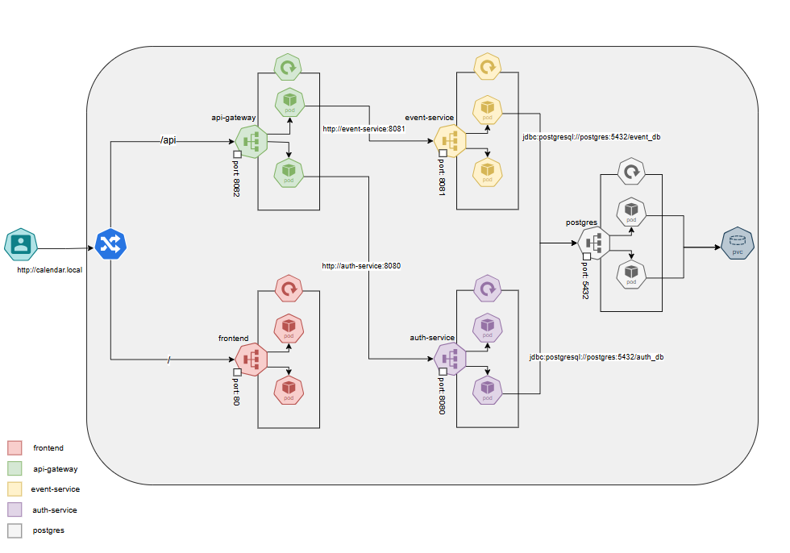

# Calendar App

## Panoramica

Calendar App è un applicazione sviluppata con un'architettura microservizi. L'applicazione permette agli utenti di creare, modificare ed eliminare eventi, organizzarli in categorie personalizzabili e visualizzarli in un'interfaccia calendario intuitiva.

## Architettura

Il progetto è strutturato secondo un'architettura microservizi, composta da:

### Frontend
- **calendar-app-frontend**: Interfaccia utente sviluppata in React

### Backend
- **api-gateway**: Gateway API che gestisce le richieste dal frontend e le instrada ai servizi appropriati
- **auth-service**: Servizio di autenticazione e gestione utenti
- **event-service**: Servizio di gestione eventi e categorie

### Infrastruttura
- **PostgreSQL**: Database relazionale per la persistenza dei dati
- **Kubernetes**: Orchestrazione dei container per il deployment
- 
## Funzionalità Principali

### Gestione Utenti
- Registrazione nuovo account
- Autenticazione con username e password
- Autenticazione JWT 

### Gestione Eventi
- Creazione di eventi con titolo, descrizione, data e ora
- Modifica e eliminazione di eventi esistenti
- Visualizzazione degli eventi in una vista calendario mensile

### Gestione Categorie
- Creazione di categorie personalizzate con nome e colore
- Assegnazione di eventi a categorie specifiche
- Modifica e eliminazione delle categorie

## Tecnologie Utilizzate

### Frontend
- **React**: Libreria JavaScript per la creazione dell'interfaccia utente
- **TailwindCSS**: Framework CSS per lo styling
- **Lucide React**: Libreria di icone
- **JWT**: Per la gestione dell'autenticazione lato client

### Backend
- **Java 17**
- **Quarkus**: Framework Java leggero ottimizzato per Kubernetes
- **RESTful API**: Per la comunicazione tra servizi
- **JWT**: Per l'autenticazione sicura
- **Hibernate/Panache**: ORM per la persistenza dei dati
- **PostgreSQL**: Database relazionale

### DevOps
- **Docker**: Per la containerizzazione delle applicazioni
- **K3s**: Distribuzione Kubernetes leggera

## Requisiti di Sistema

- **Java Development Kit (JDK) 17** o superiore
- **Node.js 16** o superiore
- **Docker** e **Kubernetes** (o K3s)
- **PostgreSQL 14** o superiore

## Installazione

```bash
# Clona la repository
git clone https://github.com/vincenzo426/calendar-app
cd calendar-app
# concedi i permessi per eseguire il file manage-calendar-app.sh
chmod +x manage-calendar-app.sh
#esegui il file che ti guidera nel processo di deployment del progetto
./manage-calendar-app.sh
```

### Demo
Per provare le funzionalità principali dell'applicazione puoi utilizzare un demo: https://vincenzo426.github.io/calendar-app/
